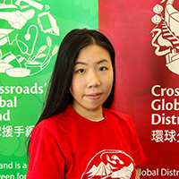
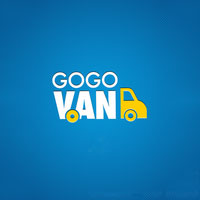
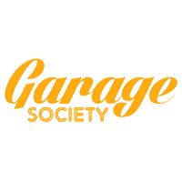

  

    <h1>About the App</h1>
    <h3>Here's how it works:</h3>
    <ol class="large-text">
      <li>
        <h5><i class="fa fa-camera"></i> Photograph items</h5> you want to offer to people in need using the GoodCity
        app (<a href="faq.html#whatkindsofgoods">what kinds of items?</a>)
      </li>
      <li>
        <h5><i class="fa fa-check-square-o"></i> Trained volunteers review items</h5> so you instantly know which can
        help (<a href="faq.html#howdoreviewersdecide">how do reviewers decide?</a>)
      </li>
      <li>
        <h5><i class="fa fa-truck"></i> You choose a transport option</h5> for the accepted items (<a
          href="faq.html#whattransportoptionsareavailable">what are the transport options?</a>).
      </li>
    </ol>
    <h4>Then&hellip;</h4>
    <ol>
      <li>
        <h5><i class="fa fa-cubes"></i> A huge volunteer labor force receives and processes</h5> the items at
        Crossroads' Tuen Mun warehouse
      </li>
      <li>
        <h5><i class="fa fa-users"></i> Social workers help their clients</h5> request items. Charities make requests
        too (<a href="faq.html#howarerequestsmade">how are requests for goods made?</a>)
      </li>
      <li>
        <h5><i class="fa fa-heart"></i> Items are received by those in need</h5> and a variety of good causes (<a
          href="faq.html#whoishelped">who is helped?</a>).
      </li>
    </ol>
  

  

    
    <h4>By Crossroads Foundation</h4>
    
<a href="https://www.crossroads.org.hk/global-distribution/" class="button small">Visit Website</a>

  

  

    <h1>Core Team</h1>
    
GoodCity is the tip of an iceberg. Every staff member at Crossroads Foundation (all of whom are self-funded
      volunteers), thousands of part-time volunteers and a myriad of supporters that keep Crossroads running are
      necessary for GoodCity to accomplish anything.

  

  

    
    <h4>Matthew Gow</h4>
    <h5>Chief Instigator</h5>
    
CTO at Crossroads Foundation. Building online tools for decades and wanting to pursue
      this project for years.

    
<a href="https://www.linkedin.com/in/matthew-gow-0570a42b/" class="button small">Matt on LinkedIn</a>

  

  

    
    <h4>Steve Kenworthy</h4>
    <h5>Chief Engineer</h5>
    
Head of Software Engineering at Crossroads Foundation. Steve makes computers do things
      that help people.

    
<a href="https://github.com/steveyken" class="button small">Steve in code</a>

  

  

    
    <h4>Nokia Cheung (R.S.W)</h4>
    <h5>NGO Liaison</h5>
    
Nokia helps Hong Kong's charities and social workers get the most out of GoodCity for
      their projects and beneficiaries.

    
<a href="https://www.linkedin.com/in/nokiacheung/" class="button small">Nokia on LinkedIn</a>

  

  

    
    <h4>Michael McDonald</h4>
    <h5>Software Engineer</h5>
    
Michael has contributed his considerable software engineering talents to make GoodCity
      a reality.

    
<a href="https://github.com/mcm-ham" class="button small">Michael in code</a>

  

  

    
    <h4>Jenny Ng</h4>
    <h5>Translator</h5>
    
Jenny helps us say what we mean to every audience.

    <!-- 
<a href="https://github.com/steveyken" class="button small">Steve in code</a>
 -->
  

  

    <!---->
    
<i class="fa fa-camera"></i>

    <h4>You?</h4>
    <h5>Volunteer with us</h5>
    
Become a GoodCity volunteer. 

    
<a href="get-involved.html#volunteer" class="button small">Read more</a>

  

  

    <h1 id="partners">Sponsors, Partners, Advisors, Contributors</h1>
  

  

    
    <h4>Operation Santa Claus</h4>
    <h5>Major Sponsor</h5>
    
GoodCity won a pitch competition as part of the Operation Santa Claus/UBS NGO
      Leadership Programme 2016.

    
<a href="https://web.swk.cuhk.edu.hk/en-gb/home/leadership/project-and-pitching" class="button small">website</a>
    

  

  

    
    <h4>Microsoft</h4>
    <h5>Technology Partner</h5>
    
GoodCity.HK is powered by the Azure platform ensuring fast a reliable service.

    
<a href="http://www.microsoft.com/en-hk/" class="button small">Website</a>

  

  

    
    <h4>Hogan Lovells</h4>
    <h5>Pro-bono Legal</h5>
    
Hogan Lovells has been generous in advising us so that we can better protect the
      interests of everyone involved.

    
<a href="http://www.hoganlovells.com/hong-kong/" class="button small">website</a>

  

  

    
    <h4>GoGoVan</h4>
    <h5>Logistics Partner</h5>
    
Commercial van hire can be booked from within the GoodCity App. But behind the
      scenes... GoGoVan!

    
<a href="http://gogovan.com.hk/en/" class="button small">Website</a>

  

  

    
    <h4>Garage Society</h4>
    <h5>Co-working space</h5>
    
We are grateful to Garage Society for providing us with access to their workspace and
      their think tank.

    
<a href="http://www.thegaragesociety.com/" class="button small">Website</a>

  

  

    
<i class="fa fa-camera"></i>

    <h4>Your Company?</h4>
    <h5>Become a Corporate Partner</h5>
    
If your company's resources might be a strategic advantage to GoodCity.HK please get
      in touch.

    
<a href="get-involved.html#corporate-partnerships" class="button small">Read more</a>

  

  

    
    <h4>Adam George</h4>
    <h5>Web Developer</h5>
    
Adam volunteers his years of experience to help develop our public website.

    
<a href="https://medium.com/@adaw" class="button small">Website</a>

  

  

    
    <h4>UI Breakfast</h4>
    <h5>UI/UX Consulting</h5>
    
We engaged Jane Portman at UI Breakfast for UI/UX and art direction. You should too.
    

    
<a href="http://uibreakfast.com/" class="button small">website</a>

  

  

    
<i class="fa fa-camera"></i>

    <h4>Your Company?</h4>
    <h5>Become a Corporate Partner</h5>
    
If your company's resources might be a strategic advantage to GoodCity.HK please get
      in touch.

    
<a href="get-involved.html#corporate-partnerships" class="button small">Read more</a>

  

