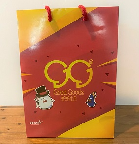

# Respond to COVID-19

### Donating Goods

<a href="/redir.html?app=donor" class="button large">Donate goods now</a>

In partnership with HKCSS and HKJC we are accepting donations of items including: masks (3 ply, 95% BFE), sanitiser (ideally >75% alcohol), medical caps, protective clothing, goggles/protective eye guards, medical gloves, other epidemic preventative materials.

_Note: Covid-19 has temporarily impacted some parts of our operations. We appreciate your patience as we seek to accommodate your kind offers as best we can with limited staff._

[Learn how donating works on our "about" page](/about.html)

To express our gratitude for your generosity, Good Goods Social Enterprise underthe HKCSS is launching the campaign “Good Present for Good People against the Coronavirus”, sending gifts from selected social enterprises to those who donate anti-epidemic materials through the GoodCity.HK platform. It's our way of saying 'thank-you' to our generous donors, and to encourage you to keep supporting NGOs and local social enterprises. [Click here](https://www.goodgoods.hk/en/content/goodpresentforgoodpeople-eng) for more.

### Requesting Goods

<a href="https://charities.goodcity.hk?ln=en" class="button large">Visit "GoodCity for Charities"</a>

GoodCity makes it easy for Hong Kong's charities and social welfare organisations to request goods for their programs and beneficiaries.
